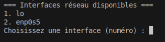

<!-- _class: title-slide -->
<!-- _paginate: false -->
<!-- _footer: "" -->
<!-- _header: "" -->

# Capture et analyse de trames brutes

---

<!-- _class: content -->

## Objectifs de la séance :

- Comprendre ce qu'est une trame réseau
- Découvrir les raw sockets en Python
- Créer notre premier analyseur de trafic
- Visualiser les données réseau en hexadécimal

---

<!-- _class: content -->

## Qu'est-ce qu'une trame réseau ?

Une **trame** est un paquet de données qui circule sur le réseau.


---

<!-- _class: content -->

### Contenu d'une trame :
- **En-têtes** : informations de routage (adresses MAC, IP, ports...)
- **Données** : le contenu réel (page web, email, fichier...)
- **Contrôles** : vérification d'intégrité

**Analogie :** Une trame = une enveloppe postale avec son contenu

---

<!-- _class: content -->

## Pourquoi capturer le trafic réseau ?

### Applications pratiques :
- **Diagnostic réseau** : identifier les problèmes de connectivité
- **Sécurité** : détecter les attaques et intrusions
- **Analyse de performance** : mesurer la bande passante
- **Apprentissage** : comprendre le fonctionnement des protocoles

---

<!-- _class: content -->

### Outils existants :
- Wireshark, tcpdump, tshark...

### Bibliothèques Python :
- pcap, scapy, pyshark...

### Mais… on ne les utilisera pas! Pourquoi ???
- **Apprentissage** : comprendre les mécanismes de base
- **Pédagogie** : maîtriser avant d'utiliser des outils complexes

---

<!-- _class: content -->

## Notre environnement de travail

### Configuration :
- **Système** : Ubuntu 24.04 (machine virtuelle)
- **Langage** : Python 3 (sans bibliothèques externes)
- **Privilèges** : sudo requis pour les raw sockets

### Avantages de cette approche :
- Compréhension des mécanismes de base
- Contrôle total sur le processus
- Pas de dépendances externes à installer

---

<!-- _class: content -->

## Architecture de notre sniffer

### Le processus étape par étape :

1. **Interface réseau** : Choisir eth0, wlan0, etc.
2. **Raw Socket** : Se "brancher" sur l'interface
3. **Capture** : Récupérer les trames qui passent  
4. **Hexdump** : Convertir les bytes en format lisible
5. **Affichage** : Montrer le résultat à l'écran

<br />

```
Interface eth0 → Raw Socket → Trame (bytes) → Hexdump → Affichage
     ↓              ↓            ↓              ↓          ↓
   [WiFi]       [Écouter]   [b'\x08\x00']    [08 00]    "08 00"
```
---

<!-- _class: content -->

## Qu'est-ce qu'une interface réseau ?

**Définition technique :** Point de connexion logique entre le système d'exploitation et le matériel réseau

### Concrètement, une interface réseau :
- **Représente** une carte réseau physique ou virtuelle
- **Possède** un nom unique dans le système (eth0, wlan0...)
- **A une adresse MAC** unique (identifiant physique)
- **Peut envoyer/recevoir** des trames sur le réseau
- **Est gérée** par le pilote (driver) du système

---

<!-- _class: content -->

### Interfaces typiques :
- `lo` : interface de bouclage (localhost)
- `eth0` : interface Ethernet filaire
- `wlan0` : interface WiFi
- `docker0` : interface Docker (si installé)

<br />

**Important :** Notre script voit les interfaces comme le système les voit !

---

<!-- _class: content -->

## Sélection de l'interface réseau

```python
interfaces = socket.if_nameindex()
print("=== Interfaces réseau disponibles ===")
for idx, (if_index, if_name) in enumerate(interfaces, start=1):
    print(f"{idx}. {if_name}")
```

### Que fait cette ligne ?

```python
socket.if_nameindex()
``` 

- Elle interroge le système d'exploitation
- Retourne une liste de tuples : `[(index, nom), (index, nom)...]`
- Exemple : `[(1, 'lo'), (2, 'eth0'), (3, 'wlan0')]`

---

<!-- _class: content -->

### Et cette ligne ?

```python
for idx, (if_index, if_name) in enumerate(interfaces, start=1):
```

- `enumerate(interfaces, start=1)` : ajoute un compteur qui commence à 1
- `(if_index, if_name)` : déballage de tuple (unpacking)
- `if_index` : numéro système de l'interface (on ne l'utilise pas ici)
- `if_name` : nom de l'interface (eth0, wlan0...)

<br />

---

<!-- _class: content -->

### On demande à l’utilisateur de choisir une interface.

```python
while True:
  try:
      choice = int(input("Choisissez une interface (numéro) : "))
      if 1 <= choice <= len(interfaces):
          interface = interfaces[choice - 1][1]
          break
      else:
          print("Numéro invalide, réessayez.")
  except ValueError:
      print("Veuillez entrer un nombre valide.")
```

---

<!-- _class: content -->

### Résultat


---

<!-- _class: content -->

## Les Raw Sockets : La porte d'entrée

### Qu'est-ce qu'un raw socket ?
- Interface de **bas niveau** pour accéder aux trames brutes
- Permet de capturer **tout le trafic** sur une interface
- Nécessite des **privilèges administrateur** (sudo)

---

<!-- _class: content -->

```python
import socket

# Création d'un raw socket
s = socket.socket(socket.AF_PACKET, socket.SOCK_RAW, socket.ntohs(0x0003))
```

### Paramètres expliqués :
- `AF_PACKET` : famille d'adresses pour les trames Ethernet
- `SOCK_RAW` : socket de type brut (pas de traitement automatique)
- `0x0003` : capture tous les types de protocoles

---

<!-- _class: content -->

```python
s.bind((interface, 0))
```

- `bind()` : "attache" le socket à une interface spécifique
- `interface` : nom de l'interface choisie ("eth0", "wlan0"...)
- `0` : protocole (0 = capture TOUS les types de trames)

### Pourquoi c'est important ?

**Avec bind()** : écoute seulement sur eth0 (par exemple)
**Sans bind()** : écoute sur toutes les interfaces 🤯

---

<!-- _class: content -->

## Capturons le trafic !

```python
try:
    while True:
        raw_data, addr = s.recvfrom(65535)
        print(f"Trame reçue ({len(raw_data)} octets)")
        print(hexdump(raw_data))
        print("-" * 60)
except KeyboardInterrupt:
    print("\nArrêt de la capture.")
```

---

<!-- _class: content -->

### Fonctionnement :
- `recvfrom(65535)` : attend une trame (taille max 64KB)
- Affiche la taille (`len(raw_data)`) et le contenu de chaque trame convertie en hex (`hexdump(raw_data)`)
- `Ctrl+C` pour arrêter proprement

---

<!-- _class: content -->

## La fonction hexdump

```python
def hexdump(data: bytes, length: int = 16) -> str:
    """Visualisation hexadécimale des données brutes"""
    result = []
    for i in range(0, len(data), length):
        chunk = data[i:i+length]
        hex_part = " ".join(f"{b:02x}" for b in chunk)
        ascii_part = "".join(chr(b) if 32 <= b < 127 else "." for b in chunk)
        result.append(f"{i:04x} {hex_part:<{length*3}} {ascii_part}")
    return "\n".join(result)
```

**Objectif :** Transformer des bytes illisibles en format compréhensible

---

<!-- _class: content -->

## Décortiquons hexdump() - Partie 1

```python
for i in range(0, len(data), length):
    chunk = data[i:i+length]
```

### Que fait ce code ?
- Découpe les données par **blocs de 16 octets** (par défaut)
- `i` = position actuelle dans les données
- `chunk` = portion de 16 octets à traiter

---

<!-- _class: content -->

**Exemple :** Pour 50 octets de données
- Bloc 1 : octets 0-15
- Bloc 2 : octets 16-31  
- Bloc 3 : octets 32-47
- Bloc 4 : octets 48-49 (reste)

---

<!-- _class: content -->

```python
hex_part = " ".join(f"{b:02x}" for b in chunk)
ascii_part = "".join(chr(b) if 32 <= b < 127 else "." for b in chunk)
```

### Conversion hexadécimale :
- `f"{b:02x}"` : convertit chaque octet en hexa sur 2 chiffres

### Conversion ASCII :
- `chr(b)` : convertit l'octet en caractère si printable (32-126)
- Sinon remplace par un point "."

---

<!-- _class: content -->

## Résultat de hexdump()

**Entrée :** `b"Hello World!\x00\x01\x02"`

**Sortie :**
```
0000 48 65 6c 6c 6f 20 57 6f 72 6c 64 21 00 01 02    Hello World!...
```

**Lecture :**
- `0000` : offset (position dans les données)
- `48 65 6c 6c...` : valeurs hexadécimales
- `Hello World!...` : interprétation ASCII

**C'est exactement comme dans Wireshark !**

---

<!-- _class: content -->

## Démonstration pratique

### Étapes de l'exercice :

1. **Préparation :**
   ```bash
   sudo python3 sniffer.py
   ```

2. **Sélection :** Choisir une interface active

3. **Observation :** Analyser les trames qui passent

4. **Génération de trafic :** 
   - Ping vers un site web
   - Navigation internet

---

<!-- _class: content -->

## Prochaines étapes

**Semaine 2 : Analyse des en-têtes Ethernet**
- Structure d'une trame Ethernet
- Décodage des adresses MAC
- Types de protocoles (IPv4, IPv6, ARP...)

---

# Merci pour votre attention !

**Récapitulatif de la séance :**
- ✅ Compris le concept de trame réseau
- ✅ Découvert les raw sockets Python
- ✅ Créé notre premier sniffer
- ✅ Analysé des données réseau brutes

**Bonne exploration du réseau !**