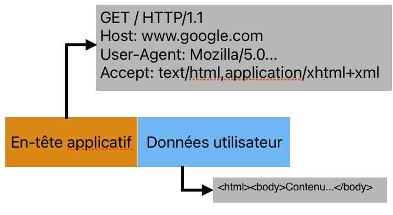
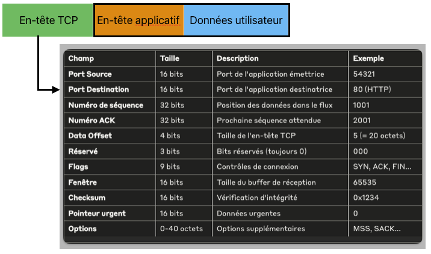
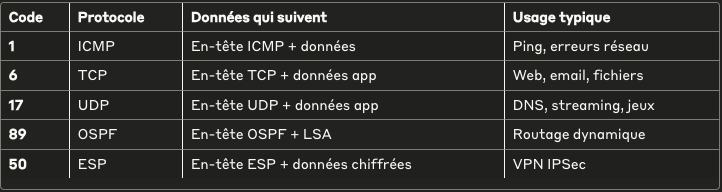
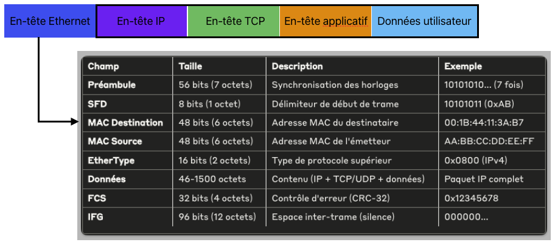

<!-- _class: title-slide -->
<!-- _paginate: false -->
<!-- _footer: "" -->
<!-- _header: "" -->

# Protocoles de Communication

## Semaine 1 : Introduction aux protocoles et fondements

### Cours 025924

**Professeur :** Mathieu Robson  
**Session :** Automne 2025  
**Durée :** 3 heures

---

<!-- _class: content -->

## Objectifs de la séance

<div class="objective-box">

- **Plan de cours**
- **Modèle OSI** : Les 7 couches de communication réseau
- **Modèle TCP/IP** : Le standard d'Internet (4 couches)
- **Encapsulation** : Comment les données voyagent sur le réseau

</div>

---

# Plan de cours

---

<!-- _class: content -->

## Présentation du cours

### Informations générales

- **Code du cours** : 025924 - Protocoles de Communication
- **Durée** : 14 semaines × 3 heures = 42 heures
- **Type** : Cours théorique et pratique

### Objectif

<div class="section-header">
<strong>L'objectif principal du cours est d'amener l'étudiant à acquérir une bonne connaissance des protocoles IP, TCP et UDP ainsi que leurs applications dans le développement de systèmes
informatiques.</strong>
</div>

---

<!-- _class: content -->

## Structure et pondération du cours

<div class="eval-table">

| **Unité**  | **Titre**                                          | **Pondération** |
| ---------- | -------------------------------------------------- | --------------- |
| **026001** | Introduction à TCP/IP, Ethernet, ARP, ICMP, DHCP   | **30%**         |
| **026002** | Couche Internet, adressage IP, fragmentation, ICMP | **35%**         |
| **026003** | Couche transport (TCP, UDP), couche application    | **35%**         |
|            | **TOTAL**                                          | **100%**        |

</div>

**Note de passage** : 60%

---

<h1>Les modèles de référence réseau</h1>

---

<!-- _class: content -->

## Pourquoi étudier les modèles réseau ?

### Les modèles nous permettent de :

1. **Structurer** la complexité des communications réseau
2. **Standardiser** les protocoles pour l'interopérabilité mondiale
3. **Diagnostiquer** les problèmes couche par couche
4. **Concevoir** de nouveaux protocoles et applications

<div class="section-header">
<strong>💡 Analogie :</strong> Comme un service postal avec différents niveaux (collecte, tri, transport, distribution), chaque couche a une responsabilité spécifique.
</div>

---

# Le modèle OSI (Open Systems Interconnection)

---

<!-- _class: content -->

## Introduction au modèle OSI

### Contexte historique
- **Créé en 1978** par l'ISO (International Organization for Standardization)
- **Objectif** : Créer un standard universel pour les communications réseau
- **Résultat** : Un modèle théorique de référence en 7 couches

### Chaque couche :
- A une **fonction spécifique** bien définie
- **Communique** uniquement avec les couches adjacentes
- Est **indépendante** des autres (principe de modularité)

---

<!-- _class: content -->

## Vue d'ensemble du modèle OSI

<div class="model-box">

### Les 7 couches (de bas en haut) :

1. **Physique** : Transmission des bits (signaux électriques)
2. **Liaison** : Organisation en trames, détection d'erreurs
3. **Réseau** : Routage et adressage logique (IP)
4. **Transport** : Fiabilité et contrôle de flux (TCP/UDP)
5. **Session** : Gestion des dialogues entre applications
6. **Présentation** : Chiffrement, compression, formatage
7. **Application** : Interface avec l'utilisateur

</div>

---

<!-- _class: content -->

## Couche 1 - Physique

### Rôle principal
Transmission des **bits bruts** (0 et 1) sur le support physique

### Responsabilités :
- **Caractéristiques électriques** : Voltage, fréquence, modulation
- **Caractéristiques mécaniques** : Types de connecteurs (RJ45, fibre optique)
- **Synchronisation** des horloges entre émetteur et récepteur
- **Topologie physique** : Bus, étoile, maillée

---

<!-- _class: content -->

## Couche 1 - Physique (suite)

### Exemples concrets :
- **Câbles** : Ethernet (Cat5e, Cat6), fibre optique
- **Sans fil** : Wi-Fi (802.11), Bluetooth
- **Équipements** : Répéteurs, concentrateurs (hubs)

---

<!-- _class: content -->

## Couche 2 - Liaison de données

### Rôle principal
Créer une communication **fiable** entre deux nœuds directement connectés

### Responsabilités :
- **Formatage** : Organisation des bits en trames structurées
- **Adressage physique** : Utilisation des adresses MAC (48 bits)
- **Détection d'erreurs** : Checksum CRC pour vérifier l'intégrité
- **Contrôle de flux** : Éviter la saturation du récepteur
- **Accès au média** : Gestion des collisions (CSMA/CD pour Ethernet)

---

<!-- _class: content -->

## Couche 2 - Liaison de données (suite)

### Exemples concrets :
- **Protocoles** : Ethernet (802.3), Wi-Fi (802.11)
- **Équipements** : Switches, ponts (bridges)
- **Format** : Trame Ethernet avec préambule, adresses MAC, données, CRC

---

<!-- _class: content -->

## Couche 3 - Réseau

### Rôle principal
Permettre la communication entre réseaux différents (**inter-réseaux**)

### Responsabilités :
- **Adressage logique** : Adresses IP (IPv4/IPv6) uniques globalement
- **Routage** : Déterminer le meilleur chemin vers la destination
- **Fragmentation** : Adapter la taille des paquets aux différents réseaux
- **Gestion de la congestion** : Éviter l'engorgement du réseau

---

<!-- _class: content -->

## Couche 3 - Réseau (suite)

### Exemples concrets :
- **Protocoles** : IP, ICMP
- **Équipements** : Routeurs, routeurs multicouches
- **Outils** : Tables de routage, protocoles de routage

---

<!-- _class: content -->

## Couche 4 - Transport

### Rôle principal
Assurer une communication **de bout en bout** fiable ou rapide

### Deux protocoles principaux :

#### TCP (Transmission Control Protocol) - Fiable
- **Connexion établie** avant transmission (3-way handshake)
- **Garantie de livraison** avec accusés de réception
- **Ordre préservé** des segments
- **Contrôle de flux** et de congestion

---

<!-- _class: content -->

## Couche 4 - Transport (suite)

#### UDP (User Datagram Protocol) - Rapide
- **Sans connexion** (fire-and-forget)
- **Pas de garantie** de livraison
- **Idéal pour** : streaming, jeux en ligne, DNS

---

<!-- _class: content -->

## Couche 5 - Session

### Rôle principal
Gérer les **dialogues** entre applications

### Responsabilités :
- **Établissement** de sessions entre applications
- **Synchronisation** : Points de reprise en cas d'interruption
- **Gestion du dialogue** : 
  - Half-duplex (chacun son tour)
  - Full-duplex (simultané)
- **Fermeture** ordonnée des sessions

---

<!-- _class: content -->

## Couche 5 - Session (suite)

### Exemples concrets :
- **Protocoles** : SQL sessions, RPC
- **Services** : NetBIOS, PPTP
- **Utilisation** : Sessions de base de données, connexions VPN

---

<!-- _class: content -->

## Couche 6 - Présentation

### Rôle principal
**Traduire** les données pour qu'elles soient compréhensibles

### Responsabilités :
- **Encodage/Décodage** : ASCII, Unicode, EBCDIC
- **Compression** : Réduire la taille des données (ZIP, GZIP)
- **Chiffrement** : Sécuriser les données (SSL/TLS)
- **Formatage** : Conversion entre formats (JPEG, MP3, XML)

---

<!-- _class: content -->

## Couche 6 - Présentation (suite)

### Exemples concrets :
- Conversion d'images pour affichage web
- Chiffrement HTTPS pour sécuriser les transactions
- Compression vidéo pour streaming

---

<!-- _class: content -->

## Couche 7 - Application

### Rôle principal
**Interface** directe avec l'utilisateur et ses applications

### Services fournis :
- **Transfert de fichiers** : FTP, SFTP
- **Messagerie** : SMTP (envoi), POP3/IMAP (réception)
- **Navigation web** : HTTP/HTTPS
- **Résolution de noms** : DNS
- **Gestion réseau** : SNMP, Telnet, SSH

---

<!-- _class: content -->

## Couche 7 - Application (suite)

### Important à retenir :
Cette couche n'est **PAS** l'application elle-même (ex: Chrome), mais les **protocoles** qu'elle utilise pour communiquer sur le réseau.

---

# Le modèle TCP/IP

---

<!-- _class: content -->

## TCP/IP : Le modèle pratique d'Internet

### Pourquoi TCP/IP ?
- **Développé** pour ARPANET (ancêtre d'Internet) dans les années 1970
- **Plus simple** : 4 couches au lieu de 7
- **Pragmatique** : Basé sur des protocoles existants et fonctionnels
- **Standard de facto** : Utilisé par tout Internet aujourd'hui

---

<!-- _class: content -->

### Comparaison avec OSI

| OSI (7 couches)      | TCP/IP (4 couches)  | 
|---------------------|---------------------|
| Application         | Application         |
| Présentation        | Application         |
| Session             | Application         |
| Transport           | Transport           |
| Réseau              | Internet            |
| Liaison             | Accès réseau        |
| Physique            | Accès réseau        |

---

<!-- _class: content -->

## Couche 1 - Accès réseau

### Fusion des couches physique et liaison OSI

### Responsabilités combinées :
- Transmission physique des bits
- Formation des trames
- Adressage MAC
- Accès au support de transmission

---

<!-- _class: content -->

## Couche 1 - Accès réseau (suite)

### Protocoles et technologies :
- **Ethernet** (le plus courant)
- **Wi-Fi** (802.11)
- **Token Ring** (historique)
- **PPP** pour connexions point à point

### 💡 Point clé :
Cette couche gère tout ce qui est nécessaire pour envoyer des données sur un **réseau local** spécifique.

---

<!-- _class: content -->

## Couche 2 - Internet

### Équivalent à la couche réseau OSI

### Protocole principal : IP (Internet Protocol)
- **IPv4** : Adresses sur 32 bits (ex: 192.168.1.1)
- **IPv6** : Adresses sur 128 bits (ex: 2001:db8::1)

### Protocoles associés :
- **ICMP** : Messages de contrôle et d'erreur (utilisé par ping)
- **ARP** : Résolution adresse IP → adresse MAC

---

<!-- _class: content -->

## Couche 2 - Internet (suite)

### Fonctions clés :
- **Routage** des paquets entre réseaux
- **Fragmentation** si nécessaire
- **Best effort** : Pas de garantie de livraison

---

<!-- _class: content -->

## Couche 3 - Transport

### Identique à la couche transport OSI

### TCP (Transmission Control Protocol)
**Caractéristiques** :
- **Orienté connexion** : Établissement avant transmission
- **Fiable** : Retransmission en cas de perte
- **Ordonné** : Les données arrivent dans l'ordre
- **Ports** : Identification des applications (ex: 80 pour HTTP)

---

<!-- _class: content -->

## Couche 3 - Transport (suite)

### UDP (User Datagram Protocol)
**Caractéristiques** :
- **Sans connexion** : Envoi direct
- **Non fiable** : Pas de retransmission
- **Rapide** : Overhead minimal
- **Ports** : Même système que TCP

---

<!-- _class: content -->

## Couche 4 - Application

### Fusion des couches 5, 6 et 7 d'OSI

### Protocoles courants par catégorie :

#### Web et transfert
- **HTTP/HTTPS** : Navigation web (ports 80/443)
- **FTP** : Transfert de fichiers (ports 20/21)

#### Messagerie
- **SMTP** : Envoi d'emails (port 25)
- **POP3/IMAP** : Réception d'emails (ports 110/143)

---

<!-- _class: content -->

## Couche 4 - Application (suite)

#### Administration
- **SSH** : Accès sécurisé (port 22)
- **Telnet** : Accès non sécurisé (port 23)
- **SNMP** : Gestion réseau (port 161)

#### Services réseau
- **DNS** : Résolution de noms (port 53)
- **DHCP** : Attribution d'adresses IP (ports 67/68)

---

# L'encapsulation des données
---

<!-- _class: content -->

## Concept d'encapsulation

### Principe fondamental
À chaque couche descendante, les données sont **encapsulées** avec de nouvelles informations d'en-tête

### Analogie pratique
Imaginez l'envoi d'une lettre :
1. **Message** (données application)
2. **Enveloppe** avec adresses (en-tête transport)
3. **Sac postal** avec code postal (en-tête réseau)
4. **Camion** avec itinéraire (en-tête liaison)
5. **Route physique** (couche physique)

### Terminologie par couche
- **Application** : Données
- **Transport** : Segment (TCP) ou Datagramme (UDP)
- **Internet** : Paquet
- **Accès réseau** : Trame

---

<!-- _class: content -->

## Processus d'encapsulation - Vue détaillée

### Exemple : Envoi d'une page web

#### 1️⃣ Couche Application



---

<!-- _class: content -->

## Processus d'encapsulation - Vue détaillée (suite)

#### 2️⃣ Couche Transport (TCP)



---

<!-- _class: content -->

<div class="model-comparison">
  <div class="model-box">
    <h3>Flags TCP importants</h3>
    <ul>
      <li><strong>SYN</strong>: Synchronisation (établissement connexion)</li>
      <li><strong>ACK</strong>: Accusé de réception</li>
      <li><strong>FIN</strong>: Fin de connexion</li>
      <li><strong>RST</strong>: Reset (fermeture forcée)</li>
      <li><strong>PSH</strong>: Push (envoi immédiat)</li>
      <li><strong>URG</strong>: Urgent</li>
    </ul>
  </div>
</div>

---

<!-- _class: content -->

## Processus d'encapsulation - Vue détaillée (suite)

#### 2️⃣ Couche Transport (UDP)


---

<!-- _class: content -->

## Processus d'encapsulation - Vue détaillée (suite)

#### 3️⃣ Couche Internet (IP)


---

<!-- _class: content -->

## Processus d'encapsulation - Vue détaillée (suite)

#### 3️⃣ Couche Internet (IP)

### Protocole



---

<!-- _class: content -->

## Processus d'encapsulation - Vue détaillée (suite)

#### 4️⃣ Couche Accès réseau (Ethernet)



---

<!-- _class: content -->

## Exemple pratique : Requête DNS

### Scénario : Résolution de www.google.com

#### 1. Application génère la requête DNS
```
Question: www.google.com Type: A
```

#### 2. Transport (UDP port 53)
```
[UDP: Src:54321 Dst:53][Requête DNS]
```

#### 3. Internet (IP)
```
[IP: Src:192.168.1.100 Dst:8.8.8.8][UDP][DNS]
```

---

<!-- _class: content -->

## Exemple pratique : Requête DNS (suite)

#### 4. Accès réseau (Ethernet)
```
[Ethernet: MAC_src MAC_dst][IP][UDP][DNS][CRC]
```

### Désencapsulation côté serveur
Le processus inverse se produit : chaque couche retire son en-tête et transmet les données à la couche supérieure.

---

<!-- _class: content -->

## Résumé et points clés à retenir

### Modèles de référence
✅ **OSI** : 7 couches, modèle théorique complet
✅ **TCP/IP** : 4 couches, standard pratique d'Internet

### Encapsulation
✅ Chaque couche ajoute son en-tête
✅ Données → Segment → Paquet → Trame
✅ Désencapsulation inverse à la réception

---

<!-- _class: title-slide -->
<!-- _paginate: false -->

# Questions ?

## Contact
mrobso@lacitec.on.ca


